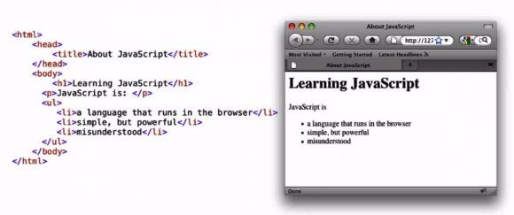
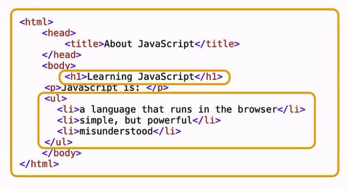
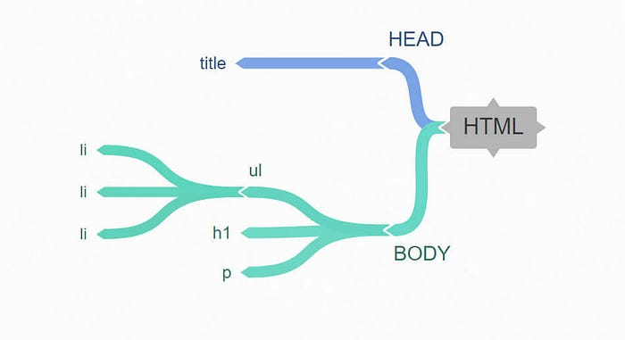

I’m going to write about one of the core concepts of the web: the DOM. Whether you’re brand-new to JavaScript or have been working with it for a while, this paper is worth a read. We’ll understand the Document Object Model (DOM). Those who have spent several years working with JavaScript know that mastering the DOM is the single most important skill for a web programmer. But what is the DOM? Is it a language, part of JavaScript? What exactly is it? When you google the term DOM, you find phrases like, “The Document Object Model is an application programming interface that defines the logical structure of well-formed XML and HTML documents,” which doesn’t help most people, but it’s quite a simple idea.

Let's break down the DOM piece by piece. What do we mean by a document? For us, the document simply means the page—not the site, but the web page. The web page is the document which can be represented in different ways. You know this already.

After all, which one of these is the web page? Both of them. One is the browser view, the other is the source code. It’s the same document; it just has different representations. We also need to understand how JavaScript observes the same document and different representations.

By now we understand what the document part of DOM is. But what’s the object part of the Document Object Model? When we talk about objects in programming languages, it’s easy to get caught up in deep semantics, but we don’t need to. Dates are objects, arrays are objects. I can make my own objects. An object is just a thing, something, anything that makes sense to treat as an individual piece, even if it contains other things. For us, it means the elements, the components, the individual pieces of this document. Look at the `h1` tag, look at the unordered list, look at the whole document. All of these things are objects.

Now, let’s talk about the Model. You’ve seen flowcharts or database diagrams taking something complex and making it abstract. In a web page, we can take any HTML and represent it as a tree structure like this:

With the simplest of HTML, we have a head and a body. The head contains the title element, the body contains an `h1` for a heading, a `p` for a paragraph, and an unordered list. The unordered list contains three list items. This diagram represents the tree structure of this HTML document.

We call each of these pieces nodes. A paragraph tag, a body, an `h1`—all are nodes. We could even describe relationships, like ancestors and descendants. So the model is simply a set of terms we can agree on, a set of standards we can use. We end up with an agreed-upon set of terms describing exactly how to interact with the pieces of a web page. That’s a long phrase, so we call it the Document Object Model. It’s not a language. It’s a convention. It’s an agreed-upon terminology that lets us describe and interact with any web page. Not one specific one, anyone. When I know the basic concepts of the DOM, I can write JavaScript that navigates around any page. That’s why we need to know the DOM. It is the way to reach into the page from our script and the way our page can reach into our script.
