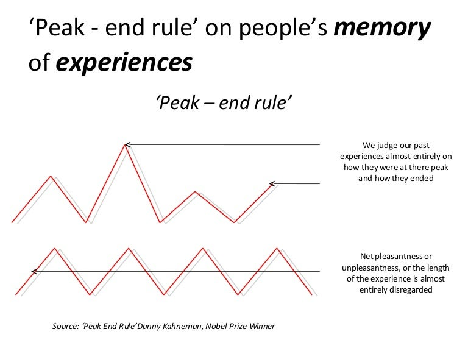

Timing is everything. That’s the gist of Daniel H. Pink's book, *When: The Scientific Secrets of Perfect Timing*. I first read the Persian translation many years ago, and I still find it fascinating. It’s one of those books that make you rethink how you go about your day-to-day activities.

Pink shares scientific and surprising findings that have serious consequences. For instance, did you know that the timing of your surgery is important? Studies show that far more mistakes are made later in the day, so be sure to get a morning appointment!

The book also reveals that we have a cycle of effectiveness, which Pink calls the "Waves of the Day." Each day, our disposition goes through three stages: a peak, a trough, and a recovery. This cycle is crucial because we should tailor our activities to match the best time for each task. For example, most people perform analytical tasks better in the morning and more insightful tasks in the evening. The worst time to tackle serious problems is in the afternoon—our "trough" time. During this period, we are least effective and "good for very little." So, it’s best to use that time for trivial things like checking email.

In short, all of us experience the day in three stages—a peak, a trough, and a recovery. About three-quarters of us (larks and third birds) experience it in that order. But for about one in four people, those whose genes or age make them night owls, the day goes in a different order—recovery, trough, peak. Personally, I'm in the first category: "peak, trough, recovery." It’s also worth noting that our internal clocks can change as we age.

Another important concept Pink discusses is the "Peak-End Rule." This cognitive bias affects how we remember past events. Intense positive or negative moments (the “peaks”) and the final moments of an experience (the “end”) are heavily weighted in our memories. This means that the duration of an event doesn't matter as much as the peak and the end of it. For example, when we remember a trip, we recall the peak moments and the end, not how long it lasted.

I think this rule emphasizes how our memories are shaped by specific moments rather than the entirety of an experience. It's fascinating but also highlights the complexity of how our emotions and memories are formed.
