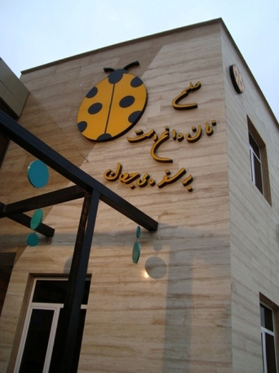
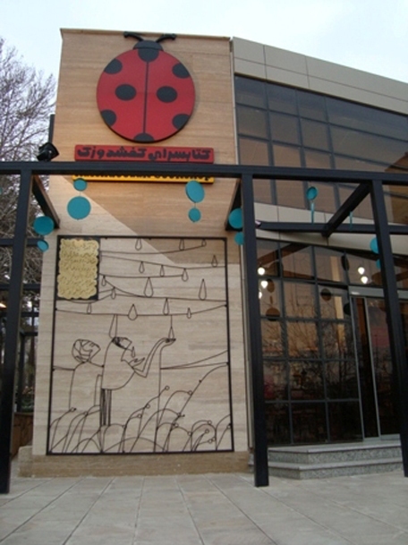
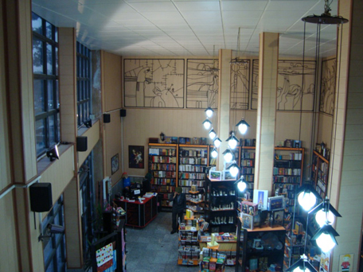

Ardeshir Rostami and his dear wife had a bookstore named Kafshdoozak, located in Azimieh, Karaj. I loved that place. It might not have been a big bookstore, but most of the books there were chosen by Mr. Rostami himself. Because of this, you could always find a book worth reading. The first floor had books and stationery, and the second floor had handicrafts and music. The décor was done by Mr. Rostami himself, and you could see his works on the walls. Additionally, the outer wall of the bookstore was adorned with one of Yiannis Ritsos’ poems.

Bookstore was located in a Park called Iran-Zamin Park. Holidays were always busy. During the Nowruz holidays of 1391 (March 2012), Mr. Rostami, who was a friend of my father, asked him to recommend someone to help out at bookstore for a few days. My father recommended me. I was unemployed at the time, waiting for my military service call. A few days turned into a few months, and until I left for military service, I worked at that bookstore.

On the [thirteenth day of Farvardin](https://en.wikipedia.org/wiki/Sizdah_Be-dar), the park was full of people celebrating the end of the Nowruz holidays. People would drop by the bookstore as well. It was noon, and the park was filled with the aroma of kebabs and barbeques. Someone entered the bookstore, looked around, and not seeing anything but books and stationery, asked me:

- "Is the 'Hot Bread and Hot Kebab' upstairs?"

I didn't understand his question. I asked in surprise:

- "Sorry?"

He thought I hadn't heard him and repeated his question louder:

- "Is the 'Hot Bread and Hot Kebab' upstairs?"

This time I was sure I heard him correctly. I smiled and said:

- "Hot kebab? This is a bookstore."

With a puzzled and somewhat disappointed look, he said:

- "Then why is it written 'Hot Bread, Hot Kebab' on the wall?"

That's when I realized. I told him:

- "Sorry, that's a poem by Yiannis Ritsos: 'Peace is warm bread on the world’s table'."

He apologized and left the bookstore. I felt bad for disappointing him. I thought nothing would have made him happier at that moment than a hot bread and hot kebab. After all, where does 'peace' fit into a person's calculations when the whole park smells of kebab, and all you want is kebab? Still, I thought, if there wasn't peace, how could we sit together and eat kebab?

In the end, I'm going to share this great poem called 'Peace' by Yiannis Ritsos Translated by Kimon Friar.

---

*The dreams of a child are peace*

*The dreams of a mother are peace*

*The words of love under the trees are peace*

*The father who returns at dusk with a wide smile in his eyes*

*with a basket in his hands full of fruit*

*and the drops of sweat on his brow*

*which are like drops on a jug as it cools its water on the windowsill,*

*are peace*

*When wounds heal on the world’s face*

*and in the pits dug by shellfire we have planted trees*

*and in hearts scorched by conflagration hope sprouts its first buds*

*and the dead can turn over on their side and sleep without complaining*

*knowing their blood was not spilled in vain,*

*this is peace.*

*Peace is the odour of food at evening*

*When an automobile stopping in the street does not mean fear*

*When a knock on the door means a friend*

*And the opening of a window every hour means sky*

*Feasting our eyes with the distant bells of its colours,*

*this is peace.*

*Peace is a glass of warm milk and a book before the awakening child*

*When wheat stalks lean toward one another saying: the light, the light*

*And the horizon’s wreath overbrims with light,*

*This is peace.*

*…*

*When death takes up but little room in the heart*

*And chimneys point with firm fingers at happiness*

*When the large carnation of sunset*

*can be smelled equally by poet and proletariat,*

*this is peace.*

*Peace is the clenched fist of men*

*it is warm bread on the world’s table*

*it is a mother’s smile.*

*Only this.*

*Peace is nothing else*

*And that ploughs that cut deep furrows in all earth*

*Write one name only:*

*Peace. Nothing else. Peace.*

*On the backbone of my verses*

*The train advancing toward the future*

*Laden with wheat and roses*

*Is peace.*

*My brothers*

*all the world with all its dreams*

*breathes deeply in peace.*

*Give us your hands, brothers,*

*This is peace.*

