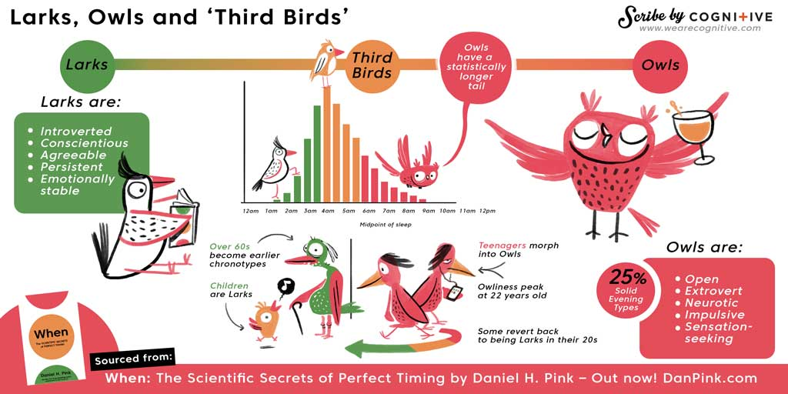
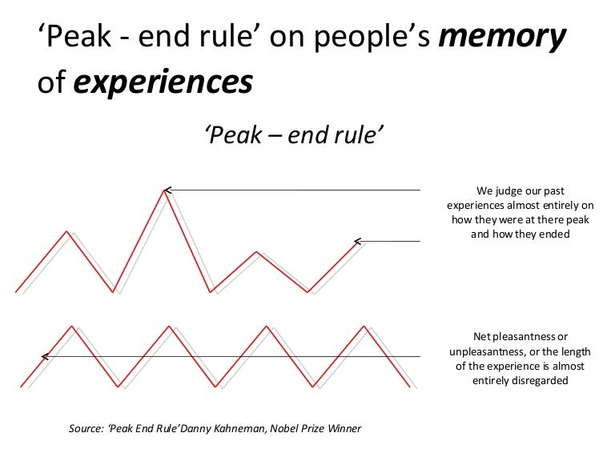

زمان همه‌چیز است. این خلاصه‌ٔ کتاب *کی؟ رازهای علمی زمان‌بندی عالی* نوشته‌ی دانیل اچ. پینک است. سال‌ها پیش ترجمه‌ی فارسی آن را خواندم و هنوز هم برایم جذاب است. از آن‌ دسته کتاب‌هایی‌ست که باعث می‌شود شیوه‌ی انجام کارهای روزانه‌ات را بازنگری کنی.

پینک یافته‌های علمی شگفت‌انگیزی را به اشتراک می‌گذارد که پیامدهای مهمی دارند. مثلاً می‌دانستی زمان جراحی‌ات مهم است؟ تحقیقات نشان می‌دهند اشتباهات پزشکی در ساعات پایانی روز بیشتر اتفاق می‌افتند. پس سعی کن وقتت را برای صبح رزرو کنی!

این کتاب همچنین می‌گوید که ما چرخه‌ای از اثربخشی در طول روز داریم — چیزی که پینک آن را «امواج روز» نامیده. هر روز، خلق‌و‌خوی ما سه مرحله را طی می‌کند: اوج، فرود، و بازیابی. این چرخه مهم است، چون باید فعالیت‌هایمان را متناسب با زمان مناسب هر کار تنظیم کنیم. برای نمونه، بیشتر افراد صبح‌ها برای انجام کارهای تحلیلی مؤثرترند، و عصرها برای کارهای خلاق‌تر و شهودی. بدترین زمان برای مواجهه با مسائل جدی، بعدازظهر است — زمان فرود ذهنی ما. در این بازه کم‌اثر هستیم و «تقریباً به هیچ دردی نمی‌خوریم». بهتر است این زمان را صرف کارهای ساده‌ای مثل چک کردن ایمیل کنیم.

در یک نگاه کلی، همه‌ٔ ما روزمان را در سه مرحله تجربه می‌کنیم — اوج، فرود، و بازیابی. حدود سه‌چهارم افراد (چکاوک‌ها و پرندگان سوم) این ترتیب را دارند. اما یک‌چهارم دیگر، یعنی شب‌زنده‌دارها، این چرخه را به شکل متفاوتی تجربه می‌کنند: بازیابی، فرود، اوج. خود من در دسته‌ی اول قرار می‌گیرم: «اوج، فرود، بازیابی». جالب است بدانیم که ساعت‌های درونی‌مان ممکن است با گذر زمان تغییر کنند.

مفهوم مهم دیگر که پینک به آن می‌پردازد «قانون اوج–پایان» است. این سوگیری شناختی روی نحوه‌ی یادآوری رویدادها اثر می‌گذارد. لحظات بسیار مثبت یا منفی (اوج‌ها) و لحظه‌ی پایان هر تجربه، بیشترین وزن را در حافظه‌ی ما دارند. یعنی طول یک رویداد اهمیت چندانی ندارد، بلکه اوج و پایان آن مهم‌اند. مثلاً وقتی یک سفر را به یاد می‌آوریم، لحظات اوج و پایانش را به خاطر داریم — نه اینکه چقدر طول کشیده.

به نظر من این قانون نشان می‌دهد خاطرات‌مان نه بر اساس کل تجربه، بلکه بر پایه‌ی لحظات خاص شکل می‌گیرند. واقعاً جالب است و پیچیدگیِ شکل‌گیری احساسات و حافظه را روشن‌تر می‌کند.
