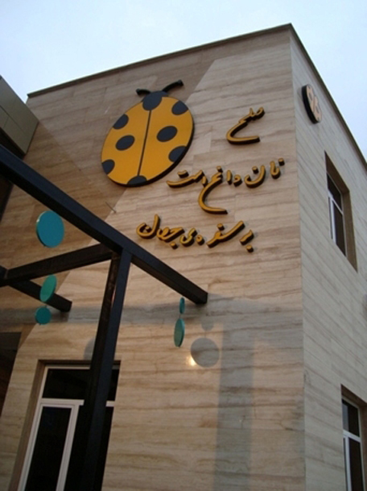
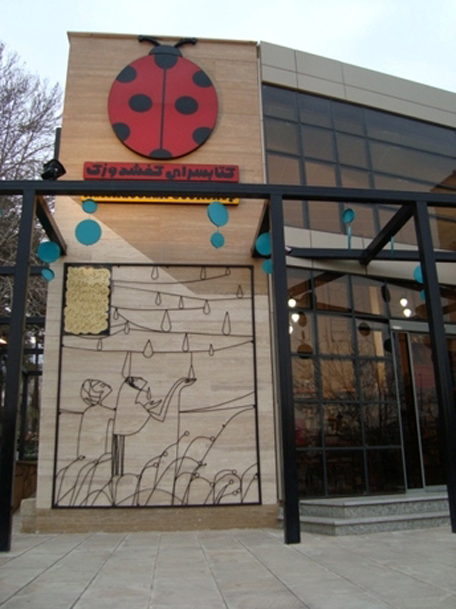

اردشیر رستمی و همسر گرامی‌اش، کتابفروشی‌ای داشتند به اسم کفشدوزک که در عظیمیه کرج، پارک ایران زمین واقع بود. آنجا را خیلی دوست داشتم. شاید کتابفروشی بزرگی نبود، ولی بیشتر کتاب‌های آنجا، کتاب‌هایی بودند که خود اردشیرخان انتخاب کرده بودند. از این جهت همیشه می‌توانستی کتابی پیدا کنی که ارزش خواندن دارد. طبقه همفک، کتاب‌ها و نوشت‌افزار، و طبقه دوم آثار دستی و موسیقی. دکور آنجا، کار دست خود آقای رستمی بود و می‌توانستی آثار استاد را روی دیوار آن ببینی. همچنین، دیوار بیرون کتابفروشی به یکی از شعرهای‌یانیس ریتسوس مزین شده بود.

روز‌های تعطیل همیشه شلوغ بود. تعطیلات عید نوروز سال ۹۱، اردشیرخان، که از دوستان پدرم بود، از او خواست که فردی را معرفی کرده، برای چند روز کمک حال بچه‌های کفشدوزک باشد. پدر، من را معرفی کرد. من در آن زمان بیکار بودم. منتظر برگ سبز سربازی. چند روز شد چند ماه و تا پیش از رفتن به سربازی، در این کتابفروشی کار می‌کردم.

روز سیزدهم فروردین، پارک پر بود از آدم‌هایی که آمده بودن سیزده‌شان را به در کنند. در کنار آن، سری هم به کتابفروشی میزدند. ظهر بود. پارک پر بود از بوی کباب. فردی وارد کتابفروشی شد. یک نگاهی به اطراف انداخت و چون غیر از کتاب و نوشت‌افزار چیزی ندید، از من پرسید:

- “نان داغ و کباب داغ” طبقه بالاست؟

از سؤالش چیزی نفهمیدم. با تعجب پرسیدم:

- بله؟!

احساس کرد که نشنیدم. سؤالش را بلندتر تکرار کرد:

- “نان داغ و کباب داغ” طبقه بالاست؟

این بار مطمئن شدم که درست شنیده بودم. با لبخند گفتم:

- کباب داغ؟! اینجا کتابفروشی است.

با نگاهی متعجب و البته ناراحت، گفت:

- پس چرا روی دیوار نوشتید “نان داغ، کباب داغ”؟!

تازه دوزاری‌ام افتاد. به او گفتم:

- ببخشید. آن یک شعر از‌ یانیس ریتسوس است: “صلح نان داغ است، بر سفره جهان”

یک ببخشید گفت و کتابفروشی را ترک کرد. ناراحت بودم از اینکه ناامیدش کردم. با خودم فکر می‌کردم، الان، هیچ چیز مثل یک نان داغ و یک کباب داغ نمی‌توانست او را خوشحال کند. آخر ”صلح” در کجای معادلات آدم جا دارد وقتی که بوی کباب کل پارک را گرفته و تو دلت فقط کباب می‌خواهد. با این حال، فکر می‌کردم، اگر صلح نبود، چه طور می‌توانستیم یک جا بشینیم و با هم کباب بخوریم.

در آخر، آن شعر‌ یانیس ریتسوس با نام “صلح” و با ترجمه بابک زمانی را برایتان می‌آورم که شاید شما هم خواندید و هوس نان داغ و کباب داغ کردید.

---

رؤیای هر کودک صلح است

رؤیای هر مادر صلح است

کلام عشقی که بر زیر درختان میتراود

صلح است.

پدری که در غبار

با تبسمی در چشم‌هایش

با سبدی میوه در دست‌هایش

با قطرات عرق بر جبینش

که چون ترمه‌ای بر طاقچه خشک می‌شود

باز گردد

صلح است.

آن هنگام که زخم‌ها

بر چهره‌ی جهان التیام یابد،

آن هنگام که چاله‌ی بمب‌های خورده بر تنش را درخت بکاریم،

آن هنگام که اولین شکوفه های‌امید

بر قلب‌های سوخته در حریق

جوانه زند،

آن هنگام که مرده‌ها بر پهلو‌های خویش بغلطند و بی‌هیچ گلایه‌ای به خواب روند

و آسوده خاطر باشند که خونشان بیهوده ریخته نشده،

آن هنگام،

درست آن هنگام

صلح است.

صلح

بوی غذای عصرگاهی ست

صلح یعنی

هنگامی که اتومبیلی در کوچه می‌ایستد

معنایش ترس نباشد.

یعنی آن کس که در را می‌زند

دوست باشد

یعنی باز کردن پنجره

معنی‌اش آسمان باشد.

صلح یعنی سور چشم‌ها

با زنگوله‌های رنگ.

آری. صلح این است.

صلح

لیوان شیر گرم است و کتاب

به بالین کودکی که بیدار می‌شود از خواب.

صلح یعنی هنگام که خوشه‌ی گندم به خوشه‌ی دیگر می‌رسد

بگوید نور. بگوید روشنی.

صلح یعنی

تاج افق، نور باشد.

آری. صلح این است.

صلح یعنی

مرگ جز اتاقی کوچک از قلبت را نتواند تسخیر کند.

یعنی دودکش خانه‌ها

نشانی از سرور باشند.

هنگامی که میخک غروب

هم بوی شاعر دهد و هم کارگر.

آری، صلح این است.

صلح

مشت‌های گره کرده‌ی مردمان است.

صلح

نان داغ بر میز جهان است.

لبخند مادر است

تنها همین

نه چیزی جز این.

آن کس که زمینش را خیش می‌کشد

تنها یک نام را بر تن خاک حک می‌کند:

صلح، نه چیزی دیگر، تنها صلح.

بر قافیه‌ی فقراتم

قطاری به سوی آینده رهسپار است

با سوغات گندم و رز.

آری. صلح همین است.

ای برادران من!

تمام عالم و‌امیالش

تنها در صلح نفسی عمیق می‌کشد.

دستانتان را به ما دهید، برادران.

آری. صلح همین است.
